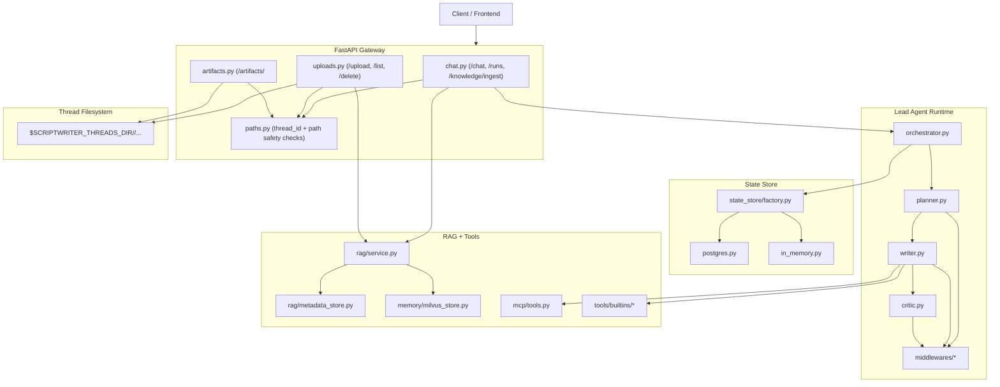
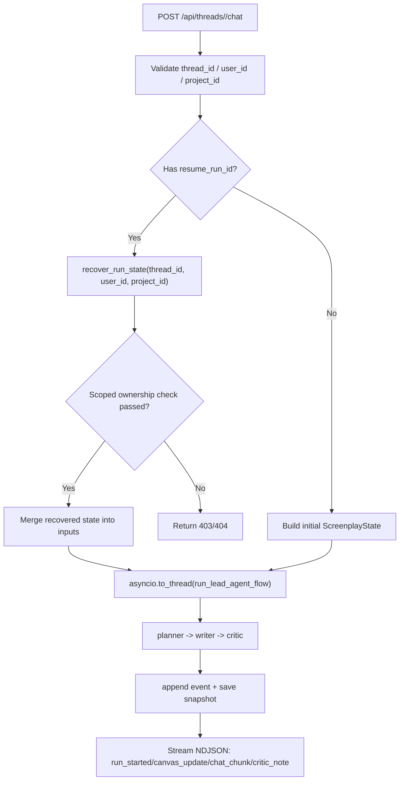
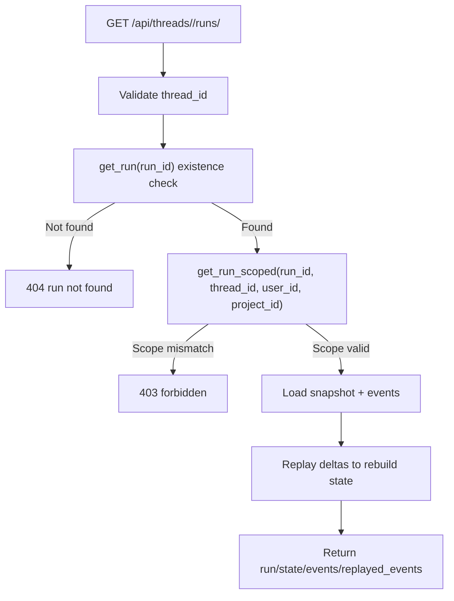
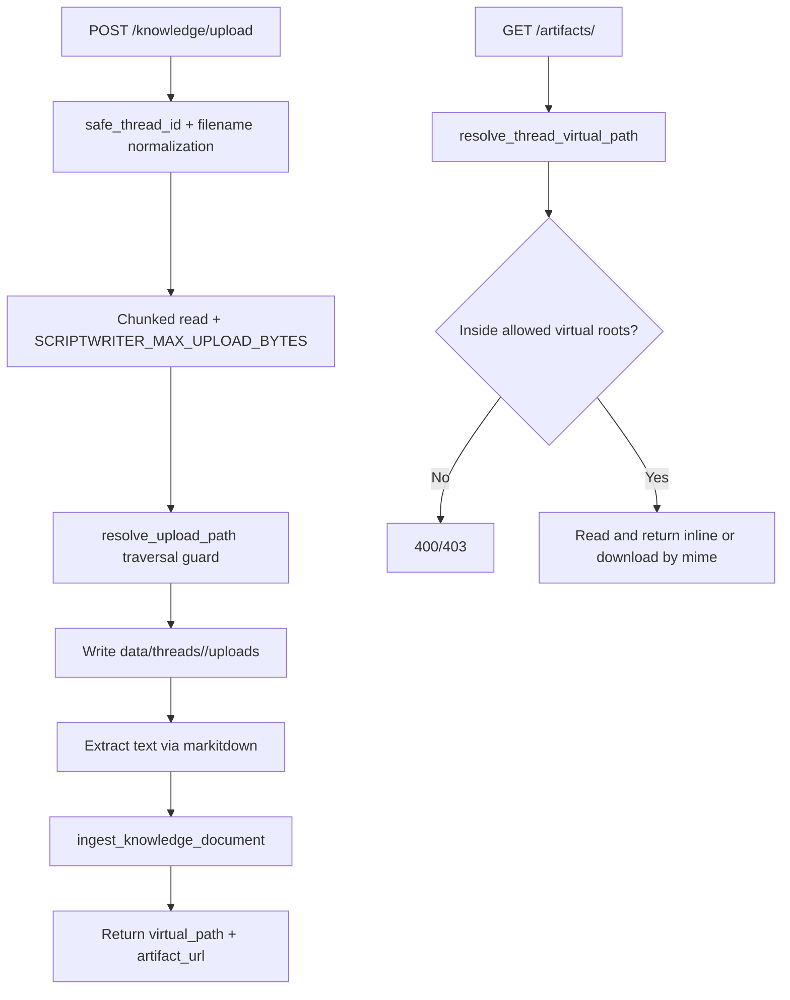

# Architecture Overview

## Runtime Topology

ScriptWriter currently runs as a single FastAPI process:

- Gateway: HTTP API + NDJSON streaming
- Orchestrator: synchronous `planner -> writer -> critic` flow
- Persistence: state store (PostgreSQL preferred, in-memory fallback)
- Knowledge: metadata + vector retrieval for story bible data

## Execution Flow

1. Client calls `POST /api/threads/{thread_id}/chat`.
2. Gateway validates `thread_id`, `user_id`, `project_id`.
3. Gateway builds `ScreenplayState` and executes orchestrator via `asyncio.to_thread(...)`.
4. Orchestrator creates/uses session, creates run, appends events + snapshots.
5. Planner/Writer/Critic produce deltas; orchestrator merges into state.
6. Gateway streams NDJSON events (`run_started`, `canvas_update`, `chat_chunk`, `critic_note`, `error`).

## Run Recovery Flow

## Upload and Artifact Access Flow

## Module Map

### Gateway

- `src/scriptwriter/gateway/app.py`: app composition
- `src/scriptwriter/gateway/paths.py`: thread/path safety utilities
- `src/scriptwriter/gateway/routers/chat.py`: chat, run recovery, knowledge ingest
- `src/scriptwriter/gateway/routers/uploads.py`: upload + list + delete
- `src/scriptwriter/gateway/routers/artifacts.py`: virtual-path artifact serving

### Agent Layer

- `src/scriptwriter/agents/thread_state.py`: canonical state schema
- `src/scriptwriter/agents/lead_agent/orchestrator.py`: orchestration + recovery
- `src/scriptwriter/agents/lead_agent/planner.py`
- `src/scriptwriter/agents/lead_agent/writer.py`
- `src/scriptwriter/agents/lead_agent/critic.py`
- `src/scriptwriter/agents/middlewares/`: prompt/state/tool integrity middlewares

### State Store

- `src/scriptwriter/state_store/base.py`: protocol + typed models
- `src/scriptwriter/state_store/factory.py`: backend selection
- `src/scriptwriter/state_store/in_memory.py`: test/dev fallback
- `src/scriptwriter/state_store/postgres.py`: durable backend

### Knowledge (RAG)

- `src/scriptwriter/rag/service.py`: ingest/search orchestration
- `src/scriptwriter/rag/metadata_store.py`: SQLite metadata index
- `src/scriptwriter/agents/memory/milvus_store.py`: vector store adapter

### MCP and Tools

- `src/scriptwriter/mcp/client.py`: MCP server config adapter
- `src/scriptwriter/mcp/tools.py`: cached MCP tool loader
- `src/scriptwriter/tools/builtins/`: story bible search/store, web search, skill read

## Data Boundaries

- Thread files: `${SCRIPTWRITER_THREADS_DIR}/{thread_id}/...`
- Virtual artifact paths: `/mnt/user-data/{uploads|outputs|workspace}/...`
- Knowledge metadata/source: `${SCRIPTWRITER_RAG_DATA_DIR}`
- State store data: PostgreSQL tables or process memory

## Compatibility Notes

- Public APIs are thread-scoped.
- Legacy non-thread-scoped endpoints are removed.
- `user_id` and `project_id` are mandatory for all write/recovery flows.
