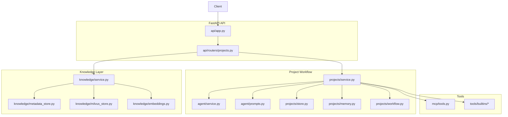
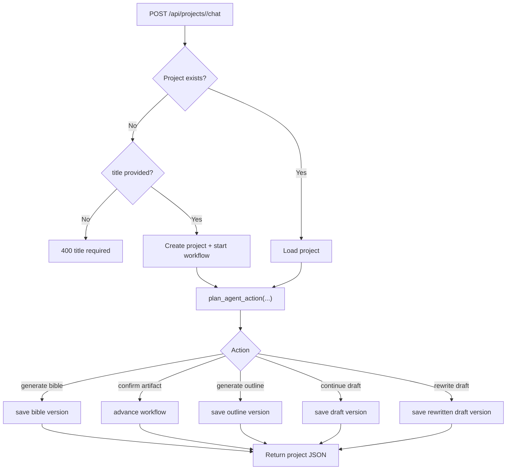
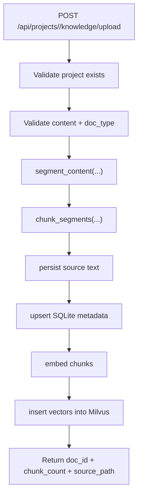

# Architecture Overview

## Runtime Topology

ScriptWriter currently runs as a single FastAPI process centered on project workflow management.

- API: project CRUD, workflow chat, confirmation, version listing, knowledge ingest
- Workflow: `bible -> outline -> draft`, advanced synchronously per request
- Project state: in-memory repository for projects, versions, and confirmation records
- Knowledge: SQLite metadata plus Milvus-backed vector search
- Tools: optional MCP tools plus built-in knowledge and web search tools

## Project Workflow

The API is project-centric rather than thread-centric.

1. A client creates a project explicitly with `POST /api/projects`, or implicitly by calling `POST /api/projects/{project_id}/chat` with a `title`.
2. `ProjectService.handle_chat(...)` converts the current project state into a workflow state.
3. `plan_agent_action(...)` classifies the message using keyword heuristics such as approve, continue, and rewrite.
4. The service generates the next artifact version:
   - bible via `build_bible_prompt(...)`
   - outline via `build_outline_prompt(...)`
   - draft via `build_draft_prompt(...)`
   - rewrite via `build_rewrite_prompt(...)`
5. The updated project and artifact versions are returned as JSON.

## Knowledge Flow

Knowledge ingest is separate from the in-memory project store.

1. `POST /api/projects/{project_id}/knowledge/upload` checks that the project exists.
2. `ingest_knowledge_document(...)` validates `doc_type`, segments text, and chunks it.
3. Source text is persisted under `${SCRIPTWRITER_RAG_DATA_DIR:-data/rag}/sources/`.
4. Document and chunk metadata are stored in SQLite.
5. Embeddings are generated and inserted into Milvus when available.

## Module Map

### API

- `src/scriptwriter/api/app.py`: FastAPI app composition
- `src/scriptwriter/api/routers/projects.py`: all public routes

### Workflow

- `src/scriptwriter/projects/service.py`: project orchestration
- `src/scriptwriter/projects/workflow.py`: workflow states and transitions
- `src/scriptwriter/projects/store.py`: in-memory project/version store
- `src/scriptwriter/projects/models.py`: API and domain models
- `src/scriptwriter/agent/service.py`: action planning heuristics
- `src/scriptwriter/agent/prompts.py`: artifact prompt builders

### Memory

- `src/scriptwriter/projects/memory.py`: in-memory character, world, fact, and timeline snapshot utilities

### Knowledge

- `src/scriptwriter/knowledge/service.py`: ingest and retrieval orchestration
- `src/scriptwriter/knowledge/metadata_store.py`: SQLite metadata and source management
- `src/scriptwriter/knowledge/milvus_store.py`: vector storage and filtered search
- `src/scriptwriter/knowledge/embeddings.py`: OpenAI or hash-based embeddings

### MCP and Tools

- `src/scriptwriter/mcp/client.py`: MCP server config adapter
- `src/scriptwriter/mcp/tools.py`: cached MCP tool loader
- `src/scriptwriter/tools/builtins/`: knowledge search/store, web search, skill read

## Data Boundaries

- Project records and artifact versions: process memory only
- Knowledge metadata and sources: `${SCRIPTWRITER_RAG_DATA_DIR:-data/rag}`
- Milvus local database: `${SCRIPTWRITER_MILVUS_DB_PATH:-./data/milvus_demo.db}`

## Compatibility Notes

- Public APIs are project-scoped.
- There is no run persistence or recovery API in the current implementation.
- Restarting the service clears project workflow state but does not remove persisted knowledge files.
