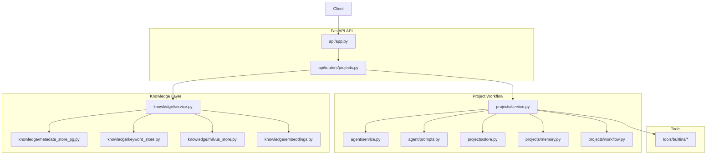
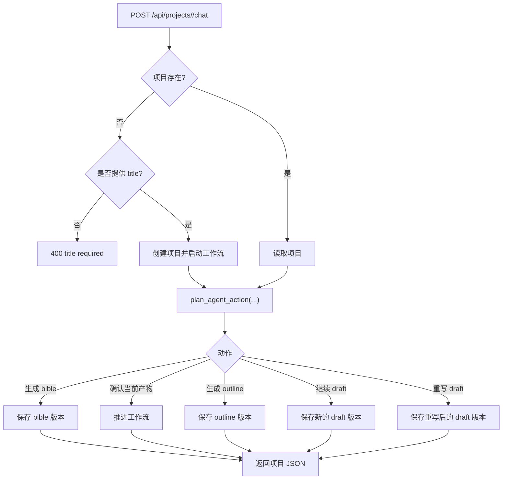
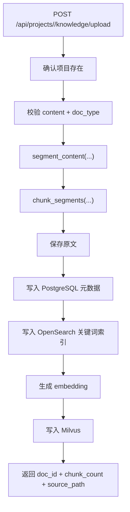

# 架构总览

## 运行拓扑

ScriptWriter 当前是单进程 FastAPI 服务，核心职责是管理项目级剧本工作流。

- API：项目创建 / 查询、工作流 chat、确认、版本列表、知识入库
- 工作流：按请求同步推进 `bible -> outline -> draft`
- 项目状态：项目、版本、确认记录都保存在进程内存
- 知识库：PostgreSQL 元数据、OpenSearch 关键词索引与 Milvus 向量检索
- 工具：内置知识检索与联网搜索工具

## 项目工作流

当前 API 以 project 为中心，而不是 thread。

1. 客户端可以先调用 `POST /api/projects` 创建项目，也可以直接调用 `POST /api/projects/{project_id}/chat` 并携带 `title` 让接口隐式创建项目。
2. `ProjectService.handle_chat(...)` 会把当前项目转换成工作流状态。
3. `plan_agent_action(...)` 通过 approve、continue、rewrite 等关键词来判断本次动作。
4. 服务生成下一个产物版本：
   - bible: `build_bible_prompt(...)`
   - outline: `build_outline_prompt(...)`
   - draft: `build_draft_prompt(...)`
   - rewrite: `build_rewrite_prompt(...)`
5. 最终返回更新后的项目 JSON。

## 知识入库流程

知识库与项目内存仓库是分开的。

1. `POST /api/projects/{project_id}/knowledge/upload` 先确认项目存在。
2. `ingest_knowledge_document(...)` 校验 `doc_type`，然后分段、切块。
3. 原文落到 `${SCRIPTWRITER_RAG_DATA_DIR:-data/rag}/sources/`。
4. 文档元数据写入 PostgreSQL，chunk 关键词索引写入 OpenSearch。
5. 生成 embedding 并写入 Milvus。

## 模块分层

### API

- `src/scriptwriter/api/app.py`：FastAPI 应用装配
- `src/scriptwriter/api/routers/projects.py`：所有公开路由

### 工作流

- `src/scriptwriter/projects/service.py`：项目工作流编排
- `src/scriptwriter/projects/workflow.py`：工作流状态与流转
- `src/scriptwriter/projects/store.py`：内存版项目 / 版本仓库
- `src/scriptwriter/projects/models.py`：领域与接口模型
- `src/scriptwriter/agent/service.py`：动作判定逻辑
- `src/scriptwriter/agent/prompts.py`：各类产物 prompt 构造

### Memory

- `src/scriptwriter/projects/memory.py`：人物、世界规则、事实、时间线快照工具

### Knowledge

- `src/scriptwriter/knowledge/service.py`：入库与检索编排
- `src/scriptwriter/knowledge/metadata_store_pg.py`：PostgreSQL 元数据与原文管理
- `src/scriptwriter/knowledge/keyword_store.py`：OpenSearch 关键词索引适配
- `src/scriptwriter/knowledge/milvus_store.py`：向量写入与过滤检索
- `src/scriptwriter/knowledge/embeddings.py`：OpenAI 或哈希 embedding

### 工具

- `src/scriptwriter/tools/builtins/`：知识检索与联网搜索工具

## 数据边界

- 项目记录与版本：仅存在于进程内存
- 知识元数据与原文：`${SCRIPTWRITER_RAG_DATA_DIR:-data/rag}`
- Milvus 本地数据库：`${SCRIPTWRITER_MILVUS_DB_PATH:-./data/milvus_demo.db}`

## 兼容性说明

- 当前公开 API 全部是 project-scoped。
- 当前实现没有 run 持久化或恢复接口。
- 服务重启会清空项目工作流状态，但不会删除已经落盘的知识库文件。
