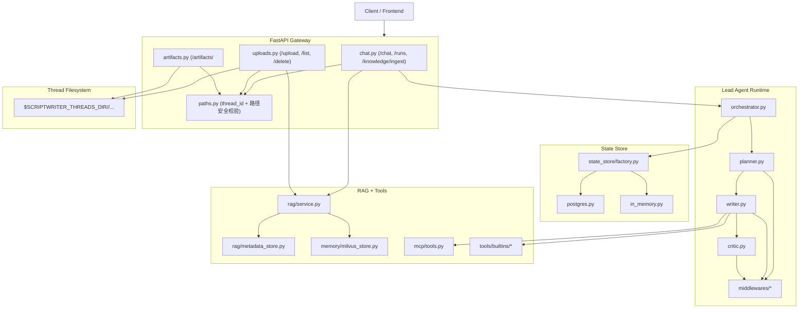
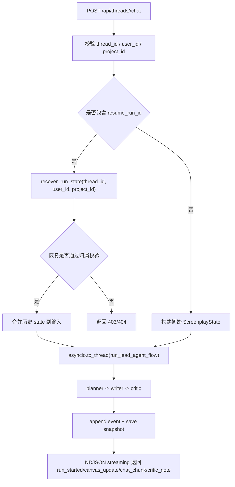
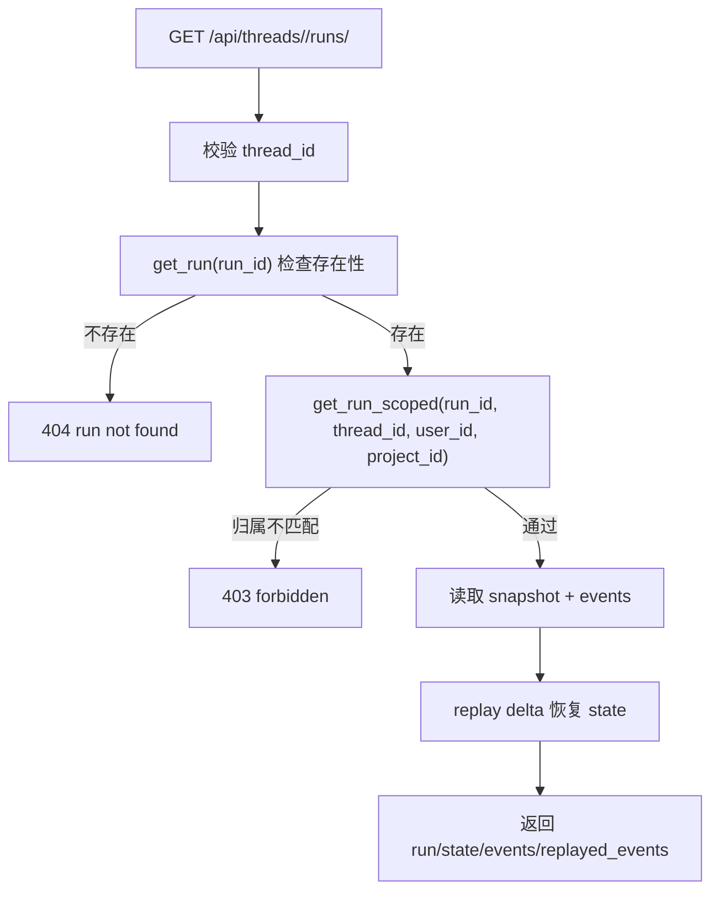
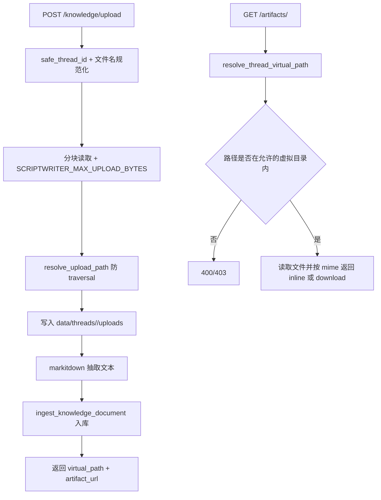

# 架构总览

## 运行拓扑

ScriptWriter 目前是单进程 FastAPI 服务：

- Gateway：HTTP API + NDJSON 流输出
- Orchestrator：同步 `planner -> writer -> critic` 编排
- Persistence：状态存储（优先 PostgreSQL，回退 InMemory）
- Knowledge：故事知识的元数据与向量检索

## 执行流程

1. 客户端请求 `POST /api/threads/{thread_id}/chat`。
2. Gateway 校验 `thread_id`、`user_id`、`project_id`。
3. Gateway 构造 `ScreenplayState`，并通过 `asyncio.to_thread(...)` 执行编排。
4. Orchestrator 创建/复用 session，创建 run，写入 event 与 snapshot。
5. Planner/Writer/Critic 返回 delta，编排器合并状态。
6. Gateway 以 NDJSON 持续返回 `run_started`、`canvas_update`、`chat_chunk`、`critic_note`、`error`。

## 运行恢复链路

## 上传与产物访问链路

## 模块分层

### Gateway

- `src/scriptwriter/gateway/app.py`：应用装配
- `src/scriptwriter/gateway/paths.py`：线程路径与安全校验
- `src/scriptwriter/gateway/routers/chat.py`：聊天、run 恢复、知识入库
- `src/scriptwriter/gateway/routers/uploads.py`：上传、列举、删除
- `src/scriptwriter/gateway/routers/artifacts.py`：虚拟路径文件访问

### Agent 层

- `src/scriptwriter/agents/thread_state.py`：状态结构
- `src/scriptwriter/agents/lead_agent/orchestrator.py`：编排与恢复
- `src/scriptwriter/agents/lead_agent/planner.py`
- `src/scriptwriter/agents/lead_agent/writer.py`
- `src/scriptwriter/agents/lead_agent/critic.py`
- `src/scriptwriter/agents/middlewares/`：上下文/提示/工具完整性中间件

### State Store

- `src/scriptwriter/state_store/base.py`：协议与类型
- `src/scriptwriter/state_store/factory.py`：后端选择
- `src/scriptwriter/state_store/in_memory.py`：本地回退
- `src/scriptwriter/state_store/postgres.py`：持久化后端

### Knowledge（RAG）

- `src/scriptwriter/rag/service.py`：入库与检索编排
- `src/scriptwriter/rag/metadata_store.py`：SQLite 元数据
- `src/scriptwriter/agents/memory/milvus_store.py`：向量存储适配

### MCP 与工具

- `src/scriptwriter/mcp/client.py`：MCP 配置解析
- `src/scriptwriter/mcp/tools.py`：MCP 工具缓存加载
- `src/scriptwriter/tools/builtins/`：知识检索/存储、联网搜索、技能读取

## 数据边界

- 线程文件：`${SCRIPTWRITER_THREADS_DIR}/{thread_id}/...`
- 虚拟路径：`/mnt/user-data/{uploads|outputs|workspace}/...`
- 知识库：`${SCRIPTWRITER_RAG_DATA_DIR}`
- 运行状态：PostgreSQL 或进程内存

## 兼容性说明

- 公共 API 已全部 thread-scoped。
- 旧的非 thread-scoped 接口已移除。
- `user_id` 与 `project_id` 现在都是必填。
